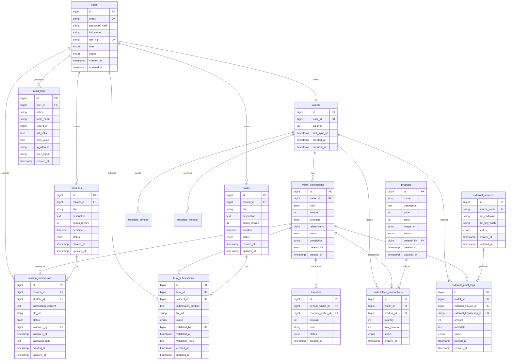

# Platform Wallet Point Gamifikasi Kampus - Database Design

## 📋 Table of Contents
1. [ERD (Entity Relationship Diagram)](#erd)
2. [Database Schema](#database-schema)
3. [Table Definitions](#table-definitions)
4. [Design Principles](#design-principles)

---

## 🗂️ ERD



---

## 📊 Database Schema

### Core Tables
1. **users** - User accounts (Admin, Dosen, Mahasiswa)
2. **wallets** - User wallet balances (1:1 with users)
3. **wallet_transactions** - Immutable transaction records

### Mission & Task Tables
4. **missions** - Gamification missions created by Dosen
5. **mission_submissions** - Student mission submissions
6. **tasks** - Academic tasks created by Dosen
7. **task_submissions** - Student task submissions

### Transfer & Marketplace Tables
8. **transfers** - Peer-to-peer point transfers
9. **products** - Marketplace products managed by Admin
10. **marketplace_transactions** - Product purchase records

### External Integration Tables
11. **external_sources** - External API configurations
12. **external_point_logs** - External point synchronization logs

### Audit Table
13. **audit_logs** - System-wide audit trail

---

## 📋 Table Definitions

### 1. users
```sql
CREATE TABLE users (
    id BIGINT UNSIGNED AUTO_INCREMENT PRIMARY KEY,
    email VARCHAR(255) NOT NULL UNIQUE,
    password_hash VARCHAR(255) NOT NULL,
    full_name VARCHAR(255) NOT NULL,
    nim_nip VARCHAR(50) NOT NULL UNIQUE,
    role ENUM('admin', 'dosen', 'mahasiswa') NOT NULL,
    status ENUM('active', 'inactive', 'suspended') DEFAULT 'active',
    created_at TIMESTAMP DEFAULT CURRENT_TIMESTAMP,
    updated_at TIMESTAMP DEFAULT CURRENT_TIMESTAMP ON UPDATE CURRENT_TIMESTAMP,
    INDEX idx_role (role),
    INDEX idx_status (status),
    INDEX idx_email (email)
) ENGINE=InnoDB DEFAULT CHARSET=utf8mb4 COLLATE=utf8mb4_unicode_ci;
```

**Purpose**: Store all user accounts with role-based access control.

**Constraints**:
- PK: `id`
- UK: `email`, `nim_nip`
- `role` controls access level
- `status` for account activation

---

### 2. wallets
```sql
CREATE TABLE wallets (
    id BIGINT UNSIGNED AUTO_INCREMENT PRIMARY KEY,
    user_id BIGINT UNSIGNED NOT NULL UNIQUE,
    balance INT DEFAULT 0 NOT NULL,
    last_sync_at TIMESTAMP NULL,
    created_at TIMESTAMP DEFAULT CURRENT_TIMESTAMP,
    updated_at TIMESTAMP DEFAULT CURRENT_TIMESTAMP ON UPDATE CURRENT_TIMESTAMP,
    FOREIGN KEY (user_id) REFERENCES users(id) ON DELETE CASCADE,
    INDEX idx_user_id (user_id),
    INDEX idx_balance (balance),
    CONSTRAINT chk_balance_positive CHECK (balance >= 0)
) ENGINE=InnoDB DEFAULT CHARSET=utf8mb4 COLLATE=utf8mb4_unicode_ci;
```

**Purpose**: Cache of user point balances. Balance is aggregated from `wallet_transactions`.

**Constraints**:
- PK: `id`
- FK: `user_id` → `users(id)` ON DELETE CASCADE
- UK: `user_id` (1:1 relationship)
- CHECK: `balance >= 0`
- Balance should NOT be updated directly; use transactions only

---

### 3. wallet_transactions
```sql
CREATE TABLE wallet_transactions (
    id BIGINT UNSIGNED AUTO_INCREMENT PRIMARY KEY,
    wallet_id BIGINT UNSIGNED NOT NULL,
    type ENUM('mission', 'task', 'transfer_in', 'transfer_out', 'marketplace', 'external', 'adjustment', 'topup') NOT NULL,
    amount INT NOT NULL,
    direction ENUM('credit', 'debit') NOT NULL,
    reference_id BIGINT UNSIGNED NULL,
    status ENUM('success', 'failed', 'pending') DEFAULT 'success',
    description VARCHAR(500) NULL,
    created_by ENUM('system', 'admin', 'dosen') DEFAULT 'system',
    created_at TIMESTAMP DEFAULT CURRENT_TIMESTAMP,
    FOREIGN KEY (wallet_id) REFERENCES wallets(id) ON DELETE CASCADE,
    INDEX idx_wallet_id (wallet_id),
    INDEX idx_type (type),
    INDEX idx_reference (reference_id),
    INDEX idx_created_at (created_at),
    CONSTRAINT chk_amount_positive CHECK (amount > 0)
) ENGINE=InnoDB DEFAULT CHARSET=utf8mb4 COLLATE=utf8mb4_unicode_ci;
```

**Purpose**: Immutable record of all point movements. This is the source of truth.

**Constraints**:
- PK: `id`
- FK: `wallet_id` → `wallets(id)` ON DELETE CASCADE
- CHECK: `amount > 0`
- `reference_id` points to the source (mission_submission, transfer, etc.)
- **IMMUTABLE**: Never UPDATE or DELETE

**Transaction Types**:
- `mission`: Points from mission completion
- `task`: Points from task completion
- `transfer_in`: Points received from peer
- `transfer_out`: Points sent to peer
- `marketplace`: Points spent on products
- `external`: Points from external API
- `adjustment`: Manual correction by admin
- `topup`: Admin top-up

---

### 4. missions
```sql
CREATE TABLE missions (
    id BIGINT UNSIGNED AUTO_INCREMENT PRIMARY KEY,
    creator_id BIGINT UNSIGNED NOT NULL,
    title VARCHAR(255) NOT NULL,
    description TEXT NULL,
    points_reward INT NOT NULL,
    deadline DATETIME NULL,
    status ENUM('active', 'inactive', 'expired') DEFAULT 'active',
    created_at TIMESTAMP DEFAULT CURRENT_TIMESTAMP,
    updated_at TIMESTAMP DEFAULT CURRENT_TIMESTAMP ON UPDATE CURRENT_TIMESTAMP,
    FOREIGN KEY (creator_id) REFERENCES users(id) ON DELETE CASCADE,
    INDEX idx_creator_id (creator_id),
    INDEX idx_status (status),
    INDEX idx_deadline (deadline),
    CONSTRAINT chk_points_positive CHECK (points_reward > 0)
) ENGINE=InnoDB DEFAULT CHARSET=utf8mb4 COLLATE=utf8mb4_unicode_ci;
```

**Purpose**: Gamification missions created by Dosen.

**Constraints**:
- PK: `id`
- FK: `creator_id` → `users(id)` (Dosen only)
- CHECK: `points_reward > 0`

---

### 5. mission_submissions
```sql
CREATE TABLE mission_submissions (
    id BIGINT UNSIGNED AUTO_INCREMENT PRIMARY KEY,
    mission_id BIGINT UNSIGNED NOT NULL,
    student_id BIGINT UNSIGNED NOT NULL,
    submission_content TEXT NULL,
    file_url VARCHAR(500) NULL,
    status ENUM('pending', 'approved', 'rejected') DEFAULT 'pending',
    validated_by BIGINT UNSIGNED NULL,
    validated_at TIMESTAMP NULL,
    validation_note TEXT NULL,
    created_at TIMESTAMP DEFAULT CURRENT_TIMESTAMP,
    updated_at TIMESTAMP DEFAULT CURRENT_TIMESTAMP ON UPDATE CURRENT_TIMESTAMP,
    FOREIGN KEY (mission_id) REFERENCES missions(id) ON DELETE CASCADE,
    FOREIGN KEY (student_id) REFERENCES users(id) ON DELETE CASCADE,
    FOREIGN KEY (validated_by) REFERENCES users(id) ON DELETE SET NULL,
    INDEX idx_mission_id (mission_id),
    INDEX idx_student_id (student_id),
    INDEX idx_status (status),
    UNIQUE KEY uk_mission_student (mission_id, student_id)
) ENGINE=InnoDB DEFAULT CHARSET=utf8mb4 COLLATE=utf8mb4_unicode_ci;
```

**Purpose**: Student submissions for missions.

**Constraints**:
- PK: `id`
- FK: `mission_id` → `missions(id)`
- FK: `student_id` → `users(id)` (Mahasiswa only)
- FK: `validated_by` → `users(id)` (Dosen only)
- UK: `(mission_id, student_id)` - one submission per student per mission

**Flow**:
1. Student submits → status = 'pending'
2. Dosen approves → status = 'approved' + create `wallet_transaction` (credit)
3. Dosen rejects → status = 'rejected' + no transaction

---

### 6. tasks
```sql
CREATE TABLE tasks (
    id BIGINT UNSIGNED AUTO_INCREMENT PRIMARY KEY,
    creator_id BIGINT UNSIGNED NOT NULL,
    title VARCHAR(255) NOT NULL,
    description TEXT NULL,
    points_reward INT NOT NULL,
    deadline DATETIME NULL,
    status ENUM('active', 'inactive', 'expired') DEFAULT 'active',
    created_at TIMESTAMP DEFAULT CURRENT_TIMESTAMP,
    updated_at TIMESTAMP DEFAULT CURRENT_TIMESTAMP ON UPDATE CURRENT_TIMESTAMP,
    FOREIGN KEY (creator_id) REFERENCES users(id) ON DELETE CASCADE,
    INDEX idx_creator_id (creator_id),
    INDEX idx_status (status),
    INDEX idx_deadline (deadline),
    CONSTRAINT chk_points_positive CHECK (points_reward > 0)
) ENGINE=InnoDB DEFAULT CHARSET=utf8mb4 COLLATE=utf8mb4_unicode_ci;
```

**Purpose**: Academic tasks created by Dosen.

**Constraints**: Same as `missions` table.

---

### 7. task_submissions
```sql
CREATE TABLE task_submissions (
    id BIGINT UNSIGNED AUTO_INCREMENT PRIMARY KEY,
    task_id BIGINT UNSIGNED NOT NULL,
    student_id BIGINT UNSIGNED NOT NULL,
    submission_content TEXT NULL,
    file_url VARCHAR(500) NULL,
    status ENUM('pending', 'approved', 'rejected') DEFAULT 'pending',
    validated_by BIGINT UNSIGNED NULL,
    validated_at TIMESTAMP NULL,
    validation_note TEXT NULL,
    created_at TIMESTAMP DEFAULT CURRENT_TIMESTAMP,
    updated_at TIMESTAMP DEFAULT CURRENT_TIMESTAMP ON UPDATE CURRENT_TIMESTAMP,
    FOREIGN KEY (task_id) REFERENCES tasks(id) ON DELETE CASCADE,
    FOREIGN KEY (student_id) REFERENCES users(id) ON DELETE CASCADE,
    FOREIGN KEY (validated_by) REFERENCES users(id) ON DELETE SET NULL,
    INDEX idx_task_id (task_id),
    INDEX idx_student_id (student_id),
    INDEX idx_status (status),
    UNIQUE KEY uk_task_student (task_id, student_id)
) ENGINE=InnoDB DEFAULT CHARSET=utf8mb4 COLLATE=utf8mb4_unicode_ci;
```

**Purpose**: Student submissions for tasks.

**Constraints**: Same as `mission_submissions` table.

---

### 8. transfers
```sql
CREATE TABLE transfers (
    id BIGINT UNSIGNED AUTO_INCREMENT PRIMARY KEY,
    sender_wallet_id BIGINT UNSIGNED NOT NULL,
    receiver_wallet_id BIGINT UNSIGNED NOT NULL,
    amount INT NOT NULL,
    note VARCHAR(255) NULL,
    status ENUM('success', 'failed') DEFAULT 'success',
    created_at TIMESTAMP DEFAULT CURRENT_TIMESTAMP,
    FOREIGN KEY (sender_wallet_id) REFERENCES wallets(id) ON DELETE CASCADE,
    FOREIGN KEY (receiver_wallet_id) REFERENCES wallets(id) ON DELETE CASCADE,
    INDEX idx_sender (sender_wallet_id),
    INDEX idx_receiver (receiver_wallet_id),
    INDEX idx_created_at (created_at),
    CONSTRAINT chk_amount_positive CHECK (amount > 0),
    CONSTRAINT chk_different_wallets CHECK (sender_wallet_id != receiver_wallet_id)
) ENGINE=InnoDB DEFAULT CHARSET=utf8mb4 COLLATE=utf8mb4_unicode_ci;
```

**Purpose**: Peer-to-peer point transfers between students.

**Constraints**:
- PK: `id`
- FK: `sender_wallet_id` → `wallets(id)`
- FK: `receiver_wallet_id` → `wallets(id)`
- CHECK: `amount > 0`
- CHECK: `sender_wallet_id != receiver_wallet_id`

**Flow** (Atomic Transaction):
1. Validate sender balance >= amount
2. INSERT into `transfers` table
3. INSERT `wallet_transaction` (debit) for sender
4. INSERT `wallet_transaction` (credit) for receiver
5. UPDATE `wallets.balance` for both

---

### 9. products
```sql
CREATE TABLE products (
    id BIGINT UNSIGNED AUTO_INCREMENT PRIMARY KEY,
    name VARCHAR(255) NOT NULL,
    description TEXT NULL,
    price INT NOT NULL,
    stock INT DEFAULT 0 NOT NULL,
    image_url VARCHAR(500) NULL,
    status ENUM('active', 'inactive') DEFAULT 'active',
    created_by BIGINT UNSIGNED NOT NULL,
    created_at TIMESTAMP DEFAULT CURRENT_TIMESTAMP,
    updated_at TIMESTAMP DEFAULT CURRENT_TIMESTAMP ON UPDATE CURRENT_TIMESTAMP,
    FOREIGN KEY (created_by) REFERENCES users(id) ON DELETE CASCADE,
    INDEX idx_status (status),
    INDEX idx_price (price),
    CONSTRAINT chk_price_positive CHECK (price > 0),
    CONSTRAINT chk_stock_nonnegative CHECK (stock >= 0)
) ENGINE=InnoDB DEFAULT CHARSET=utf8mb4 COLLATE=utf8mb4_unicode_ci;
```

**Purpose**: Products in marketplace (managed by Admin).

**Constraints**:
- PK: `id`
- FK: `created_by` → `users(id)` (Admin only)
- CHECK: `price > 0`
- CHECK: `stock >= 0`

---

### 10. marketplace_transactions
```sql
CREATE TABLE marketplace_transactions (
    id BIGINT UNSIGNED AUTO_INCREMENT PRIMARY KEY,
    wallet_id BIGINT UNSIGNED NOT NULL,
    product_id BIGINT UNSIGNED NOT NULL,
    quantity INT DEFAULT 1 NOT NULL,
    total_amount INT NOT NULL,
    status ENUM('success', 'failed') DEFAULT 'success',
    created_at TIMESTAMP DEFAULT CURRENT_TIMESTAMP,
    FOREIGN KEY (wallet_id) REFERENCES wallets(id) ON DELETE CASCADE,
    FOREIGN KEY (product_id) REFERENCES products(id) ON DELETE CASCADE,
    INDEX idx_wallet_id (wallet_id),
    INDEX idx_product_id (product_id),
    INDEX idx_created_at (created_at),
    CONSTRAINT chk_quantity_positive CHECK (quantity > 0),
    CONSTRAINT chk_total_positive CHECK (total_amount > 0)
) ENGINE=InnoDB DEFAULT CHARSET=utf8mb4 COLLATE=utf8mb4_unicode_ci;
```

**Purpose**: Product purchase records.

**Constraints**:
- PK: `id`
- FK: `wallet_id` → `wallets(id)`
- FK: `product_id` → `products(id)`
- CHECK: `quantity > 0`
- CHECK: `total_amount > 0`

**Flow** (Atomic Transaction):
1. Validate wallet balance >= total_amount
2. Validate product stock >= quantity
3. INSERT into `marketplace_transactions`
4. INSERT `wallet_transaction` (debit)
5. UPDATE `wallets.balance`
6. UPDATE `products.stock` (decrement)

---

### 11. external_sources
```sql
CREATE TABLE external_sources (
    id BIGINT UNSIGNED AUTO_INCREMENT PRIMARY KEY,
    source_name VARCHAR(255) NOT NULL UNIQUE,
    api_endpoint VARCHAR(500) NOT NULL,
    api_key_hash VARCHAR(255) NULL,
    status ENUM('active', 'inactive') DEFAULT 'active',
    created_at TIMESTAMP DEFAULT CURRENT_TIMESTAMP,
    updated_at TIMESTAMP DEFAULT CURRENT_TIMESTAMP ON UPDATE CURRENT_TIMESTAMP,
    INDEX idx_status (status)
) ENGINE=InnoDB DEFAULT CHARSET=utf8mb4 COLLATE=utf8mb4_unicode_ci;
```

**Purpose**: External API configurations for point synchronization.

**Constraints**:
- PK: `id`
- UK: `source_name`

---

### 12. external_point_logs
```sql
CREATE TABLE external_point_logs (
    id BIGINT UNSIGNED AUTO_INCREMENT PRIMARY KEY,
    wallet_id BIGINT UNSIGNED NOT NULL,
    external_source_id BIGINT UNSIGNED NOT NULL,
    external_transaction_id VARCHAR(255) NOT NULL UNIQUE,
    amount INT NOT NULL,
    metadata TEXT NULL,
    status ENUM('success', 'failed', 'pending') DEFAULT 'success',
    synced_at TIMESTAMP DEFAULT CURRENT_TIMESTAMP,
    created_at TIMESTAMP DEFAULT CURRENT_TIMESTAMP,
    FOREIGN KEY (wallet_id) REFERENCES wallets(id) ON DELETE CASCADE,
    FOREIGN KEY (external_source_id) REFERENCES external_sources(id) ON DELETE CASCADE,
    INDEX idx_wallet_id (wallet_id),
    INDEX idx_external_source (external_source_id),
    INDEX idx_synced_at (synced_at),
    CONSTRAINT chk_amount_positive CHECK (amount > 0)
) ENGINE=InnoDB DEFAULT CHARSET=utf8mb4 COLLATE=utf8mb4_unicode_ci;
```

**Purpose**: Log external point synchronization (credit-only).

**Constraints**:
- PK: `id`
- FK: `wallet_id` → `wallets(id)`
- FK: `external_source_id` → `external_sources(id)`
- UK: `external_transaction_id` (prevent duplicate sync)
- CHECK: `amount > 0`

**Flow**:
1. Call external API
2. Validate response
3. INSERT into `external_point_logs`
4. INSERT `wallet_transaction` (credit, type='external')
5. UPDATE `wallets.balance`
6. UPDATE `wallets.last_sync_at`

---

### 13. audit_logs
```sql
CREATE TABLE audit_logs (
    id BIGINT UNSIGNED AUTO_INCREMENT PRIMARY KEY,
    user_id BIGINT UNSIGNED NULL,
    action VARCHAR(255) NOT NULL,
    table_name VARCHAR(100) NOT NULL,
    record_id BIGINT UNSIGNED NULL,
    old_value TEXT NULL,
    new_value TEXT NULL,
    ip_address VARCHAR(45) NULL,
    user_agent TEXT NULL,
    created_at TIMESTAMP DEFAULT CURRENT_TIMESTAMP,
    FOREIGN KEY (user_id) REFERENCES users(id) ON DELETE SET NULL,
    INDEX idx_user_id (user_id),
    INDEX idx_action (action),
    INDEX idx_table_name (table_name),
    INDEX idx_created_at (created_at)
) ENGINE=InnoDB DEFAULT CHARSET=utf8mb4 COLLATE=utf8mb4_unicode_ci;
```

**Purpose**: System-wide audit trail for compliance and debugging.

**Constraints**:
- PK: `id`
- FK: `user_id` → `users(id)` (nullable for system actions)

**Logged Actions**:
- User login/logout
- Create/update/delete operations
- Point transactions
- Validation approvals/rejections
- Admin adjustments

---

## 🎯 Design Principles

### 1. **Immutable Transactions**
- `wallet_transactions` table is append-only
- Never UPDATE or DELETE transaction records
- All balance changes must create a new transaction

### 2. **Wallet Balance as Cache**
- `wallets.balance` is a cached aggregate
- True balance = SUM of all `wallet_transactions`
- Balance can be recalculated if needed:
  ```sql
  SELECT SUM(
    CASE 
      WHEN direction = 'credit' THEN amount
      WHEN direction = 'debit' THEN -amount
    END
  ) as true_balance
  FROM wallet_transactions
  WHERE wallet_id = ? AND status = 'success';
  ```

### 3. **Atomic Transactions**
All multi-step operations must be wrapped in database transactions:
```go
BEGIN TRANSACTION;
  -- Step 1: Insert transfer record
  -- Step 2: Insert debit transaction
  -- Step 3: Insert credit transaction
  -- Step 4: Update sender balance
  -- Step 5: Update receiver balance
COMMIT; -- or ROLLBACK on error
```

### 4. **Role-Based Access Control**
- Admin: Full CRUD on all tables
- Dosen: CRUD on missions/tasks, validate submissions, view student wallets
- Mahasiswa: View own wallet, submit missions/tasks, transfer, buy products

### 5. **Data Integrity**
- Foreign keys with appropriate CASCADE/SET NULL
- CHECK constraints for business rules
- UNIQUE constraints to prevent duplicates
- Indexes for query performance

### 6. **External Integration**
- External points are credit-only (never debit)
- `external_transaction_id` prevents duplicate sync
- Read-only for mahasiswa (sync triggered by cron/webhook)

### 7. **Marketplace Synchronization**
- Stock updates are atomic with purchases
- Real-time stock validation before purchase
- No overselling (stock >= quantity check)

### 8. **Audit Trail**
- All sensitive operations logged
- User actions traceable via `audit_logs`
- Includes IP address and user agent for security

---

## 📌 Important Notes

1. **Never modify wallet balance directly**
   ```sql
   -- ❌ WRONG
   UPDATE wallets SET balance = balance + 100 WHERE id = 1;
   
   -- ✅ CORRECT
   -- 1. Insert into wallet_transactions
   -- 2. Update wallet balance via service layer
   ```

2. **Transaction reference integrity**
   - `wallet_transactions.reference_id` points to source table
   - `type` indicates which table: mission_submissions, transfers, etc.
   - Consider using a polymorphic approach or separate reference columns

3. **Deadline handling**
   - Missions/tasks with passed deadlines should have status = 'expired'
   - Implement cron job to auto-expire

4. **File storage**
   - `file_url` columns store file paths or URLs
   - Actual files stored in object storage (S3, MinIO, etc.)

5. **Password security**
   - Use bcrypt for `password_hash`
   - Never store plain text passwords

6. **API Key security**
   - `api_key_hash` uses secure hashing
   - Never store plain API keys

---

**Version**: 1.0  
**Last Updated**: 2026-01-13
